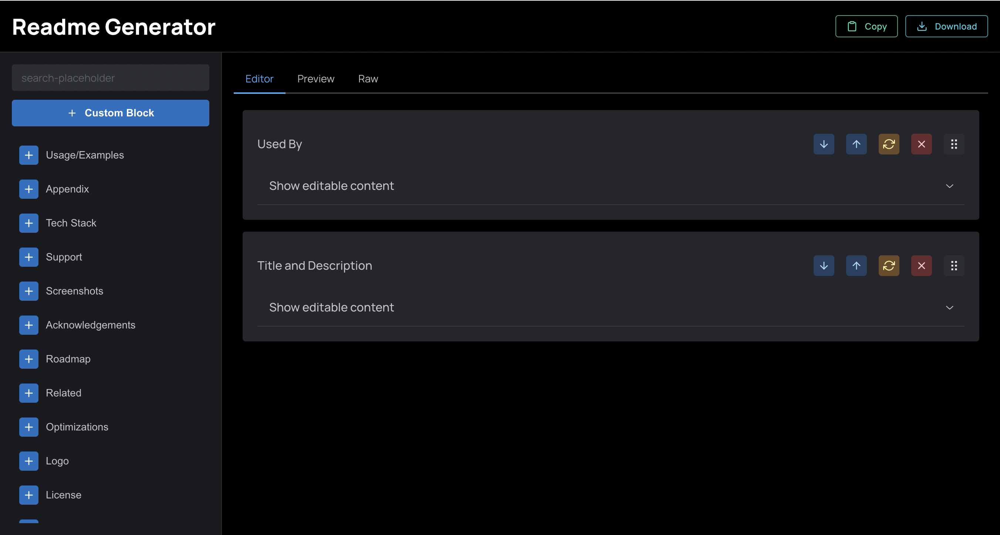

# Dynamic Project README Generator


## Description

The Dynamic Project README Generator is a tool designed to streamline the creation of README files for software projects. It automates the process of generating a comprehensive README by collecting project details and configurations through a user-friendly interface.

## Live Demo

Check out the live demo [here](https://readme-generator-m6clt6ja7-divu0804s-projects.vercel.app/).


## Features

- **Dynamic Generation**: Generate README files dynamically based on project details and configurations.
- **User-friendly Interface**: Intuitive UI for inputting project information.
- **Customizable Templates**: Customize README templates to suit different project needs.
- **Supports Markdown**: Utilizes Markdown syntax for easy formatting of content.
- **Drag and Drop Interface**: Incorporates dnd kit for effortless reordering of sections.
- **Built-in Preview**: Instantly preview generated README before finalization.
- **TypeScript Support**: Developed using TypeScript for enhanced type safety and code maintainability.

## Technologies Used

- **Next.js**: React framework for building server-rendered web applications.
- **TypeScript**: Typed superset of JavaScript for enhanced developer experience.
- **Mantine**: React component library for building accessible and customizable UI components.
- **Jotai**: Simple and atomic state management library for React.
- **dnd kit**: Drag and drop utilities for building accessible and beautiful interfaces.
- **react-markdown**: Markdown component for rendering Markdown content within React applications.

## Installation

1. Clone the repository:

   ```bash
   git clone https://github.com/your-username/dynamic-readme-generator.git
   ```

2. Navigate to the project directory:

   ```bash
   cd dynamic-readme-generator
   ```

3. Install dependencies:

   ```bash
   npm install
   ```

4. Start the development server:

   ```bash
   npm run dev
   ```

5. Open your browser and visit `http://localhost:3000`.

## Usage

1. Fill in the required project details and configurations in the provided form.
2. Use drag and drop functionality to reorder sections as desired.
3. Preview the generated README to ensure accuracy.
4. Download the finalized README file.

